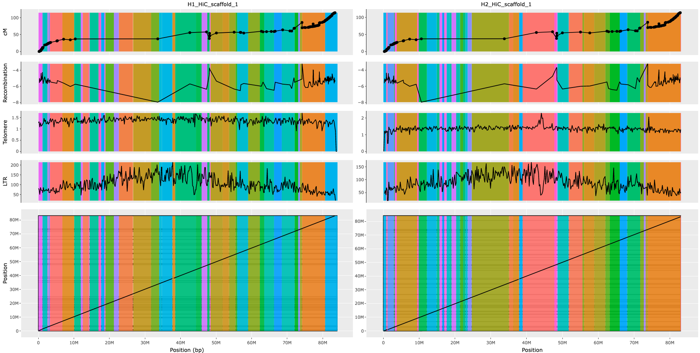
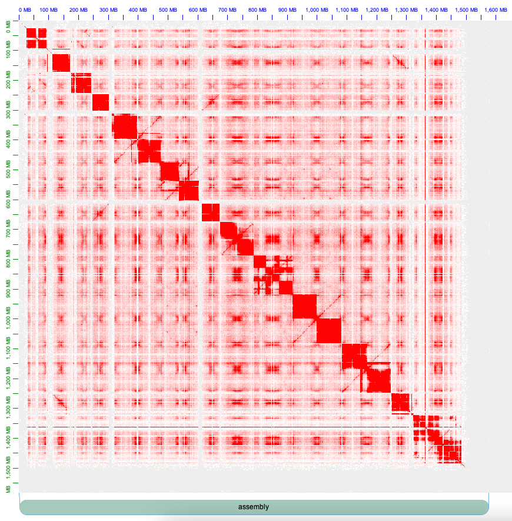
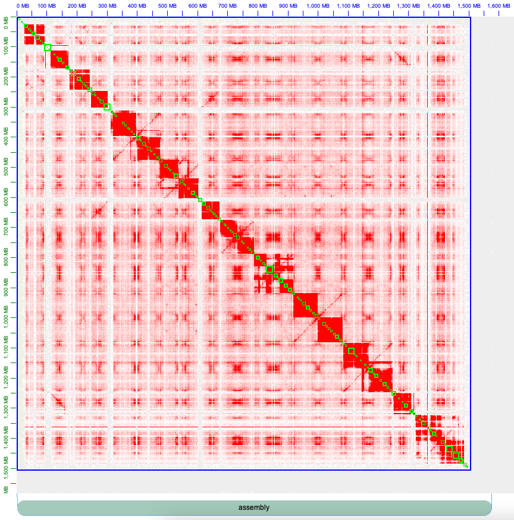

# Haplotype Aware Scaffolding

A series of custom scripts for haplotype aware manual curation of Cannabis genome assemblies

## Description

This pipeline was designed for haplotype-aware scaffolding of Cannabis genome assemblies using [Juicer](https://github.com/aidenlab/juicer) and [3D-DNA](https://github.com/aidenlab/3d-dna) for mapping Hi-C and scaffolding the genome, respectively. Unlike traditional curation of one haplotype at a time, this pipeline generates inputs for Juicebox to view two haplotypes simultaneously. Additionally, it generates interactive plots for both haplotypes to visualize genetic distance of markers, recombination rate, telomere signal frequency, LTR frequency, and alignment plot of the two haplotypes. These plots, alongside Hi-C plots, provide enough information for manual curation of Cannabis genome assemblies in [Juicebox](https://github.com/aidenlab/Juicebox). After one or several rounds of curation, the pipeline can finalize genomes by adding Ns between contigs and assigning chromosome numbers to scaffolds based on a pre-defined genome assembly (in this case, CS10).


## Step 1. HiC mapping and Scaffolding

This step focuses on mapping Hi-C reads to Haplotype 1 and Haplotype 2 of the Cannabis genome assembly separately, and then runs contig scaffolding. Additionally, it combines both haplotypes in a single FASTA file and repeats the mapping and scaffolding step. To identify corresponding scaffolds in the haplotypes of a genome assembly, the pipeline aligns the haplotypes against each other using [minimap2](https://github.com/lh3/minimap2).

It is important to note that, in [3D-DNA](https://github.com/aidenlab/3d-dna) scaffolding, the parameter `-r 0` was used. `r` defines the number of misjoin correction rounds, and by setting it to `0`, we skipped misjoin correction since [3D-DNA](https://github.com/aidenlab/3d-dna) tends to over-correct plant genome assemblies.

Step 1 can be executed with [run_step1_scaffolding.sh](https://github.com/m-jahani/haplotype_aware_scaffolding/blob/main/run_step1_scaffolding.sh) as follow:
```
bash run_step1_scaffolding.sh \
ID_HAP1 \ 
ID_HAP2 \ 
SAMPLE \
ASSEMBLY_hap1 \
ASSEMBLY_hap2 \
JUCIER_DIR \
RESULT_DIR \
HIC_R1 \
HIC_R2
```

Where each variable can be defined as follow:
```
ID_HAP1 = ID for haplotype one, example: MK_ultra_hap1
ID_HAP2 = ID for haplotype two, example: MK_ultra_hap2
SAMPLE = ID for the genotype, example: MK_ultra
ASSEMBLY_hap1 = genome assembly of haplotype 1 in fasta format, example: MK_ultra.hic.hap1.p_ctg.fasta
ASSEMBLY_hap2 = genome assembly of haplotype 2 in fasta format, example: MK_ultra.hic.hap2.p_ctg.fasta
JUCIER_DIR = Path to where Juicer was installed
RESULT_DIR = path for saving results
HIC_R1 = HiC read `R1` in fasta format
HIC_R2 = HiC read `R2` in fasta format
```

## Step 2. Drawing assembly curation guide plots
When the first step of genome scaffolding is done, we have to  draw curation guide plots (interactive information plots on haplotypes, and two haplotype HiC heatmaps) to get the enough information for manual curations. This step of pipline runs its different modules to capture this information and put them in plot format.

### Step 2.1
Generating a heatmap of both haplotypes in a single plot for Juicebox can be achieved using a custom R script [mix_reviewed_assemblies.R](https://github.com/m-jahani/haplotype_aware_scaffolding/blob/main/mix_reviewed_assemblies.R). This script takes the outputs of the first step from [3D-DNA](https://github.com/aidenlab/3d-dna) and '[minimap2](https://github.com/lh3/minimap2)' and combines the contig information data of the two haplotypes to generate a heatmap for [Juicebox](https://github.com/aidenlab/Juicebox) with both haplotypes simultaneously in a plot.

### Step 2.2
Use the custom R script [ASM2FASTA.R](https://github.com/m-jahani/haplotype_aware_scaffolding/blob/main/ASM2FASTA.R) to convert the output of Step 2.1 to fasta format efficiently. The output of [3D-DNA](https://github.com/aidenlab/3d-dna) with the "*assembly" suffix is essentially a text file containing information on the order and orientation of contigs. Since this file can be edited in [Juicebox](https://github.com/aidenlab/Juicebox), we can always obtain the fasta file after any curation.

### Step 2.3
[MAPLINKAGE.sh](https://github.com/m-jahani/haplotype_aware_scaffolding/blob/main/MAPLINKAGE.sh) calculates position of each genetic marker (from the genetic map) on each haplotype of the assembly. 

### Step 2.4
[recombination.R](https://github.com/m-jahani/haplotype_aware_scaffolding/blob/main/recombination.R) is a custom R script designed to calculate recombination rate of the genetic map, and assign it to the position of markers in the genome assemblies under curation.

### Step 2.5
[Telomere Identification toolKit (tidk)](https://github.com/tolkit/telomeric-identifier) was used in [TELOMERE.sh](https://github.com/m-jahani/haplotype_aware_scaffolding/blob/main/TELOMERE.sh) script to scan genome assemblies and calculate the frequency of telomeric repeats `TTTAGGG` in fixed size windows (here `200000`)

### Step 2.6
[EDTA](https://github.com/oushujun/EDTA) was utilized in [EDTA.sh](https://github.com/m-jahani/haplotype_aware_scaffolding/blob/main/EDTA.sh) to annotate Long Terminal Repeats (LTRs) and estimate their frequency in genome assemblies. LTRs are more frequent in centromere regions, thus providing insight into the location of the centromere

### Step 2.7
[minimap2](https://github.com/lh3/minimap2)  was used in [minimap.sh](https://github.com/m-jahani/haplotype_aware_scaffolding/blob/main/minimap.sh) script to align the two haplotypes for identifying synteny between the assemblies.

### Step 2.8
An interactive plot for each chromosome of the genome assembly was generated using a custom R script [interactive_plot.R](https://github.com/m-jahani/haplotype_aware_scaffolding/blob/main/interactive_plot.R). This script combines information from the last 7 steps of the pipeline to generate a plot that includes the following information: contig order and orientation, haplotype information, genetic distance and recombination rate of markers, frequency of telomeric repeats, frequency and location of LTRs, and alignment plot of the two haplotypes. The resulting plots can be used for manual curation of the genome assembly in [Juicebox](https://github.com/aidenlab/Juicebox)
### step 2.9
[breakingPoint.R](https://github.com/m-jahani/haplotype_aware_scaffolding/blob/main/breakingPoint.R) generate a summary table of alignment between the two haplotypes


Step 2 can be executed with [run_step2_plots.sh](https://github.com/m-jahani/haplotype_aware_scaffolding/blob/main/run_step2_plots.sh) as follow:
```
bash run_step2_plots.sh \
ID_HAP1 \ 
ID_HAP2 \ 
SAMPLE \
ASSEMBLY_hap1 \
ASSEMBLY_hap2 \
RESULT_DIR \
PRIME_3 \
PRIME_5 \
LINKAGE_DATA
```

Where each variable can be defined as follow:
```
ID_HAP1 = ID for haplotype one, example: MK_ultra_hap1
ID_HAP2 = ID for haplotype two, example: MK_ultra_hap2
SAMPLE = ID for the genotype, example: MK_ultra
ASSEMBLY_hap1 = genome assembly of haplotype 1 in fasta format, example: MK_ultra.hic.hap1.p_ctg.fasta
ASSEMBLY_hap2 = genome assembly of haplotype 2 in fasta format, example: MK_ultra.hic.hap2.p_ctg.fasta
RESULT_DIR = path for saving results
PRIME_3 = 1st primer for markers in genetic map
PRIME_5 = 2nd primer for markers in genetic map
LINKAGE_DATA = information on genetic position of each market in linkage map
```
Here is an example of interactive plots (not interactive here):

Each vertical colored bar show a contig

## Define chromosome boundaries 
To define chromosome boundaries in the Hi-C heatmap, We need to first import our Hi-C contact information and the contig order and orientation to [Juicebox](https://github.com/aidenlab/Juicebox).

To import Hi-C contact information, open Juicebox and navigate to `File` > `Open` > `Local`, then select the mixed Hi-C file from the previous steps with the suffix `.0.hic` containing the IDs of both haplotype. For example: Sweet_skunk_s47.hic.hap1.p_ctg_Sweet_skunk_s47.hic.hap2.p_ctg.0.hic.

Once imported, the Hi-C contact information should display a contact map similar to the following


To get contig information and corrct orientation and order of contigs navigate to `Assembly` > `Import Map Assembly`, select file with the suffix `0.assembly` containing the IDs of both haplotypes to [Juicebox](https://github.com/aidenlab/Juicebox). For example: Sweet_skunk_s47.hic.hap1.p_ctg_Sweet_skunk_s47.hic.hap2.p_ctg.0.assembly

Once the contig information is imported, the green boxes on the contact map will represent contig positions, similar to the following:


The blue box represents the position of the chromosomes in the contact map. As shown in the illustration above, there is only one blue box, indicating that the chromosome boundaries have not been defined. To define chromosome boundaries in Juicebox, it is necessary to pay attention to the contact pattern of Hi-C. Each red block corresponds to a chromosome (20 in the example here, as Cannabis has 10 chromosomes and 2 haplotypes are mixed). By zooming in, one can identify the beginning and end of each chromosome and split the blue box by left-clicking right after the last contig of the preceding chromosome and before the first contig of the next chromosome. 

Save the newly defined chromosome boundaries by navigating to Assembly > Export Assembly. To differentiate it from the original file, it is recommended to save it with the suffix '.review.assembly'.

## Manual genome assembly Curation
When defining chromosome boundaries, the next step is manual curation based on the interactive plots and Hi-C contact information. For those new to working with [Juicebox](https://github.com/aidenlab/Juicebox), this [video](https://www.youtube.com/watch?v=Nj7RhQZHM18&t=112s) could be helpful.

When all curation is complete and you want to save the result, navigate to `Assembly` > `Export Assembly`. To differentiate it from the original file, it is recommended to save it with the suffix `1.review.assembly`, where the number `1` indicates the first round of curation.

If you need to take a break or accidentally close Juicebox, you can easily pick up where you left off by following these steps:
- import Hi-C contact information, open Juicebox and navigate to `File` > `Open` > `Local`, then select the mixed Hi-C file from the previous steps with the suffix `.0.hic` containing the IDs of both haplotype. For example: Sweet_skunk_s47.hic.hap1.p_ctg_Sweet_skunk_s47.hic.hap2.p_ctg.0.hic.
- import assembly file with navigating to `Assembly` > `Import Map Assembly`, select file with the suffix `0.assembly` containing the IDs of both haplotypes to [Juicebox](https://github.com/aidenlab/Juicebox). For example: Sweet_skunk_s47.hic.hap1.p_ctg_Sweet_skunk_s47.hic.hap2.p_ctg.0.assembly
- import your curation with navigating to `Assembly` > `Import Modified Assembly`, select file with the suffix `1.review.assembly`. For example: Sweet_skunk_s47.hic.hap1.p_ctg_Sweet_skunk_s47.hic.hap2.p_ctg.1.review.assembly
- When new modification are done, navigate to `Assembly` > `Export Assembly`. and overwrite the modifications to the same file with suffix `1.review.assembly`, because it is still the same round of curation.

To see the changes made in the manual curation reflected in the interactive guide plot, rerun Step 3, which involves redrawing the interactive guide plots.

## Step 3. Re-drawing assembly curation guide plots


# Under Development
